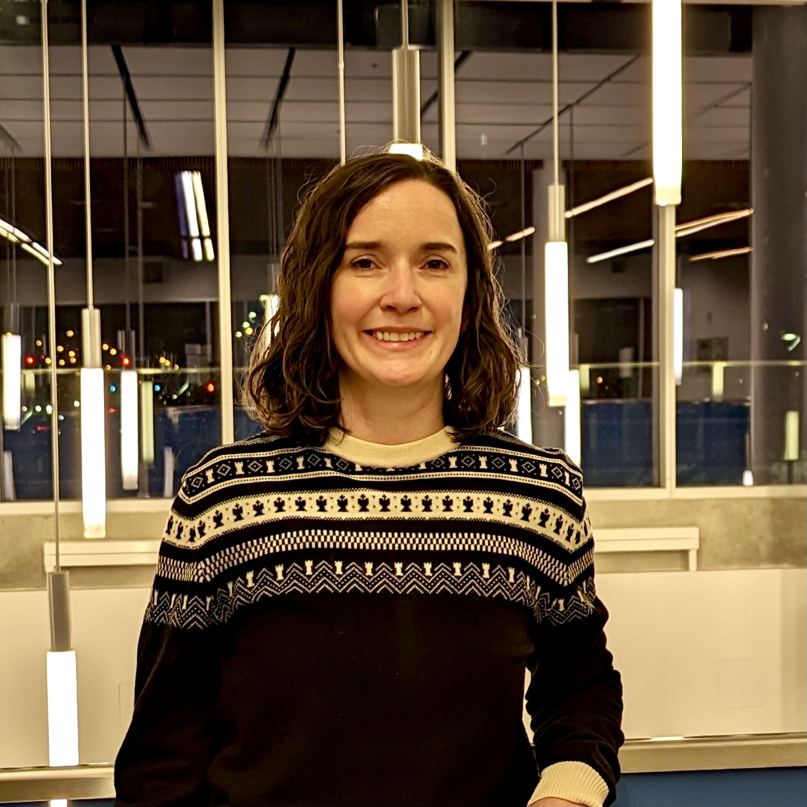

{fig-align="center" width="250" .rounded}

I'm a Toronto-based data researcher with a
Master's in cognitive neuroscience, two peer-reviewed publications,
and a public-service role at Statistics Canada.

R is my native analytical language. I’m also using Oracle SQL, APEX, and Python to build BonQuery’s projects end-to-end — database, dashboard, analysis, and writing.

I started BonQuery because so much of the publicly available data
on humanitarian issues in Canada sits on government open-data pages
where most people will never see it. The first project focuses on
Toronto's taxed shelter system. More to follow.

## Get in touch

If you work with this data, have questions about the project, or
want to collaborate:

- Get in touch with Miriam Marling at [miriam@BonQuery.ca](mailto:miriam@BonQuery.ca)
- General inquiries: [info@BonQuery.ca](mailto:info@BonQuery.ca)
- [LinkedIn](https://www.linkedin.com/in/mmarling)